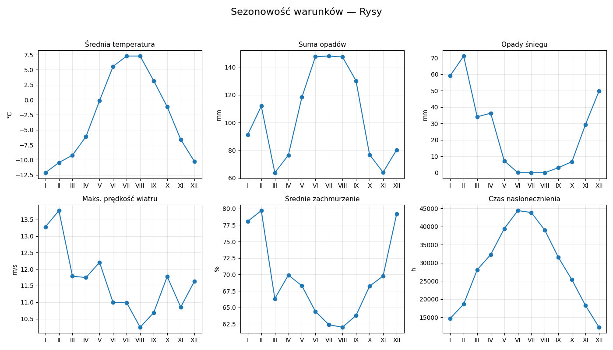

# Analiza warunków pogodowych Korony Gór Polski (2020–2024)

# Opis projektu

Projekt analizuje warunki pogodowe na 28 szczytach Korony Gór Polski (KGP) w latach 2020–2024. Uwzględnia sezonowość temperatur, opadów, wiatru, zachmurzenia i nasłonecznienia. Analiza pozwala porównać szczyty między sobą, a także w ramach regionów oraz grup wysokościowych. Celem projektu było wskazanie szczytów o najbardziej ekstremalnych warunkach oraz określenie miesięcy sprzyjających górskim wędrówkom.

# Cele analizy

1.	Określenie najbardziej deszczowych miesięcy dla każdego szczytu.
2.	Analiza sezonowości temperatur, opadów i wiatru.
3.	Porównanie różnic klimatycznych pomiędzy regionami (Tatry, Sudety, Beskidy, Góry Świętokrzyskie, Pieniny).
4.	Porównanie warunków pogodowych pomiędzy grupami wysokościowymi (<1000 m, 1000–1500 m, >1500 m).
5.	Wskazanie szczytów najbardziej ekstremalnych pod względem klimatycznym.
6.	Wyciągnięcie praktycznych wniosków przydatnych przy planowaniu wycieczek.

# Dane

- Źródło: Open-Meteo API
- Okres analizy: 2020–2024
- Agregacja: dane dzienne przekształcone do wartości miesięcznych
- Zmienne: średnia, maksymalna i minimalna temperatura, suma opadów deszczu i śniegu, prędkość wiatru, zachmurzenie

Dane Open-Meteo mają charakter siatkowy, co oznacza, że wartości pogodowe są wyznaczane na podstawie interpolacji z modeli numerycznych w regularnych punktach siatki, a nie pochodzą bezpośrednio ze stacji pomiarowych, co może wpływać na ich dokładność.
Dla Śnieżki, jedynego szczytu KGP na którym znajduje się obserwatorium meteorologiczne, przeprowadzono porównanie danych siatkowych Open-Meteo z danymi stacyjnymi IMGW. W badanym okresie średnia różnica wyniosła –0,41°C. Wartość błędu RMSE, czyli przeciętne odchylenie wartości siatkowych od pomiarów stacyjnych, wynosiło około 1,4°C. Na tej podstawie uznano, że nie ma potrzeby stosowania korekty temperatur dla wszystkich szczytów i dane Open-Meteo można uznać za wystarczająco wiarygodne do celów projektu.

# Metody

- Opracowanie profilu klimatycznego każdego szczytu
- Wykresy sezonowości temperatur, opadów i wiatru
- Analizy porównawcze regionów i grup wysokościowych
- Rankingi szczytów pod kątem ekstremalnych warunków pogodowych
- Heatmapa wskaźnika komfortu

# Wnioski z analizy

Analiza pozwoliła:
- opracować profil klimatyczny każdego z 28 szczytów,
- porównać regiony i grupy wysokościowe,
- przygotować rankingi najbardziej deszczowych, wietrznych i zimnych szczytów,
- obliczyć wskaźnik komfortu i wskazać najbardziej sprzyjające szczyty,
- stworzyć zestaw wizualizacji prezentujących warunki pogodowe.

Najważniejsze obserwacje to:

### 1. Heatmapa wskaźnika komfortu

Wskaźnik komfortu został zbudowany w oparciu o cztery elementy:
- średnia temperatura (najwyższy komfort przy wartościach umiarkowanych, ok. 10–20°C),
- suma opadów (niższe opady oznaczają wyższy komfort),
- prędkość wiatru (najwyższy komfort przy niskich wartościach),
- zachmurzenie (średnie wartości uznane za najbardziej korzystne).

Wszystkie zmienne zostały przeskalowane do wspólnej skali 0–100, a następnie połączone z równymi wagami. W ten sposób powstał syntetyczny wskaźnik komfortu wyznaczony osobno dla każdego szczytu i miesiąca.

  

- Najbardziej komfortowe warunki w latach 2020–2024 występowały na szczytach niskich i średnich – najwyższe średnie wartości wskaźnika osiągnęły Chełmiec, Kłodzka Góra, Czupel, Biskupia Kopa i Turbacz.
- Szczyty wysokie (Rysy, Śnieżka, Babia Góra) mają wyraźnie niższy wskaźnik komfortu, co potwierdza ich bardziej ekstremalne warunki. 
- Najkorzystniejszym miesiącem dla wędrówek jest lipiec, wskaźnik utrzymuje wysokie wartości także w czerwcu i sierpniu. Najtrudniejsze warunki panują zimą, szczególnie w lutym, kiedy wskaźnik osiąga najniższe wartości w roku.

---

### 2. Porównanie regionów i grup wysokościowych
  
  
- Analiza grup wysokościowych potwierdza: szczyty wysokie są zimniejsze i bardziej wilgotne, natomiast średnie wysokości mają najbardziej sprzyjające warunki turystyczne.
- Przebieg roczny temperatury jest podobny we wszystkich regionach i grupach wysokościowych: wzrost od stycznia do lipca i spadek od sierpnia do grudnia. Różnice między regionami polegają głównie na poziomie temperatury (Tatry najchłodniejsze, Góry Świętokrzyskie i Pieniny najcieplejsze).
- Opady są najwyższe od czerwca do sierpnia i najniższe w marcu–kwietniu. Sezonowy cykl jest podobny we wszystkich regionach i grupach wysokościowych, ale Tatry notują wyższy poziom opadów niż pozostałe pasma.

---

### 3. Roczny cykl pogodowy na przykładzie Rysów
  

- Temperatura: średnia roczna ma typowy przebieg – najniższe wartości zimą (–10 do –12°C w styczniu i lutym), a najwyższe latem (ok. 7°C w lipcu).
- Opady: największe sumy notowane są latem (ponad 140 mm w czerwcu–sierpniu), a najmniejsze wczesną wiosną (marzec–kwiecień).
- Opady śniegu: dominują zimą (grudzień–marzec, ponad 50–100 mm miesięcznie), zanikają całkowicie jedynie w lipcu i sierpniu.
- Wiatr: maksymalne prędkości utrzymują się na wysokim poziomie cały rok (11–14 m/s), z nieco silniejszymi epizodami zimą i wczesną wiosną.
- Zachmurzenie: najwyższe w zimie (80–85%), najniższe latem (ok. 60%).
- Nasłonecznienie: maksimum przypada na maj–lipiec (ponad 40 000 h w skali miesiąca w danych siatkowych), najniższe wartości są zimą.

Podsumowanie: Rysy charakteryzują się chłodnym klimatem, dużymi opadami i silnym wiatrem. Najkorzystniejsze warunki panują w lipcu, ale nawet wtedy średnia temperatura nie przekracza 7°C.

---

### 4. Ranking warunków pogodowych

| Kategoria                      | 1 miejsce        | 2 miejsce        | 3 miejsce        |
|--------------------------------|------------------|------------------|------------------|
| **Najbardziej deszczowe (mm)** | Tarnica (108.3)  | Rudawiec (107.7) | Śnieżnik (107.7) |
| **Najbardziej śnieżne (mm)**   | Rysy (24.7)      | Śnieżka (20.1)   | Tarnica (19.8)   |
| **Najbardziej wietrzne (m/s)** | Chełmiec (22.3)  | Waligóra (20.9)  | Ślęża (20.1)     |
| **Najbardziej słoneczne (h)**  | Rysy (28976.2)   | Radziejowa (27551.8) | Ślęża (27297.1) |
| **Najbardziej pochmurne (%)**  | Śnieżka (73.2)   | Rudawiec (72.0)  | Śnieżnik (72.0)  |
| **Najcieplejsze (°C)**         | Czupel (9.2)     | Kłodzka Góra (9.1) | Chełmiec (9.1)   |
| **Najzimniejsze (°C)**         | Rysy (–2.7)      | Śnieżka (1.6)    | Babia Góra (1.6) |

# Metody
